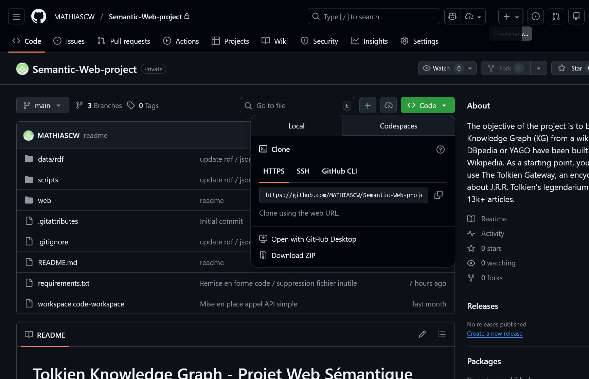
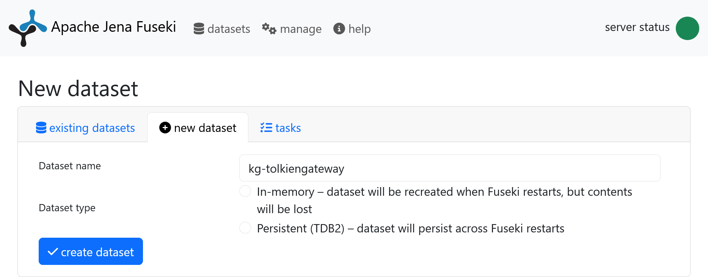
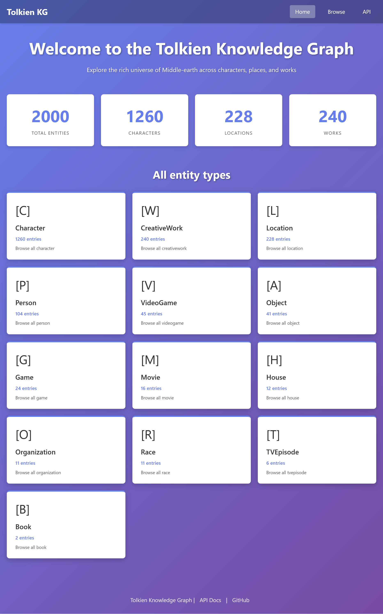
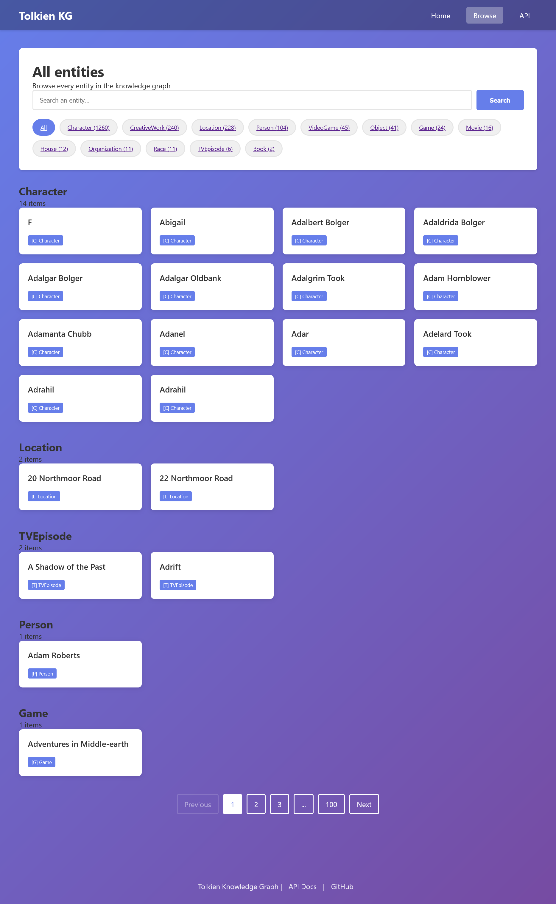
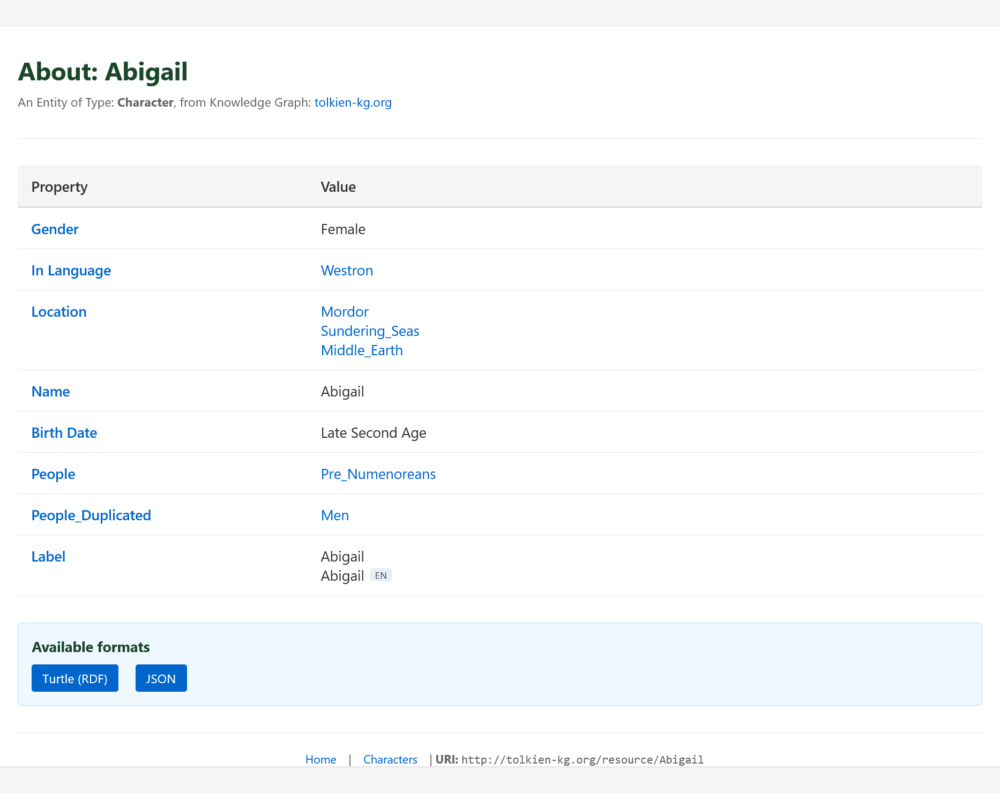
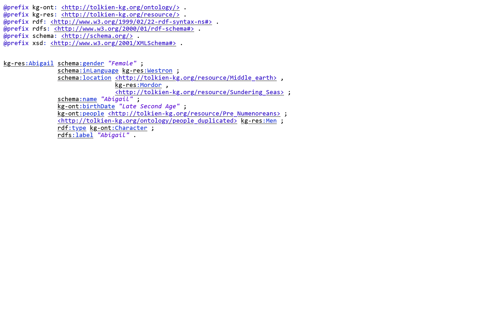
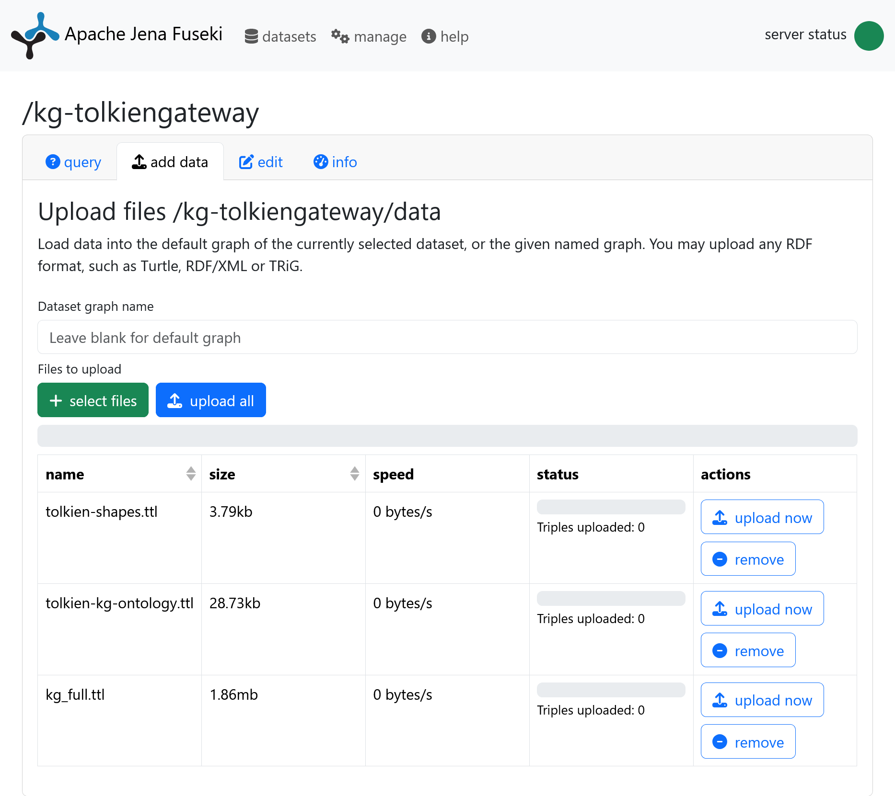
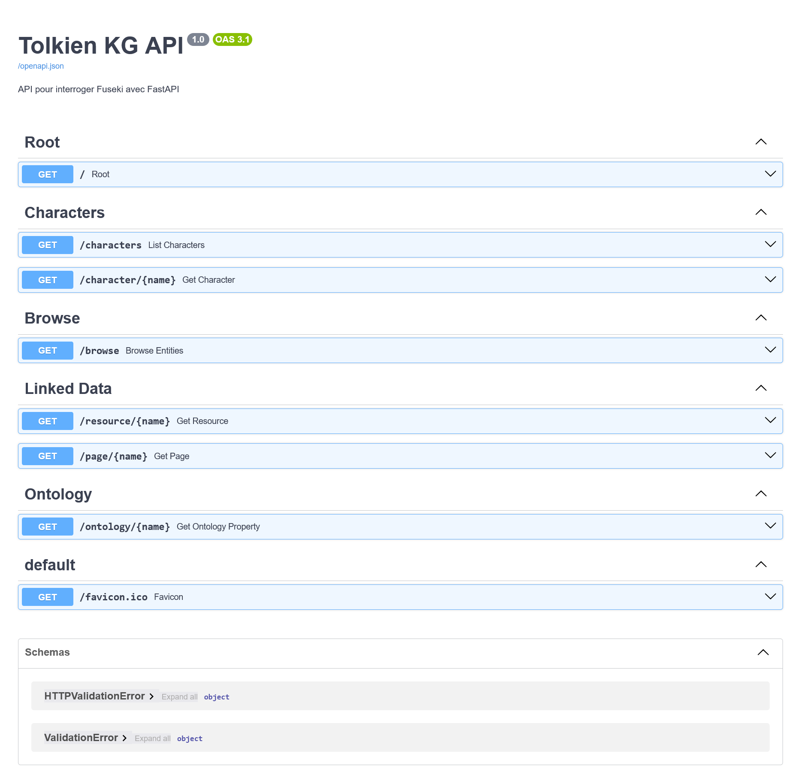

# Tolkien Knowledge Graph - Semantic Web Project

**Authors:** Mathias CHANE-WAYE, Timur BALI  
**Date:** January 2026  
**Context:** Semantic Web Project - Building a Knowledge Graph from Tolkien Gateway  

---

##  Table of Contents

1. [Project Overview](#project-overview)
2. [Complete Installation and Pipeline](#complete-installation-and-pipeline)
3. [How to Test the Project](#how-to-test-the-project)
4. [Architecture and Technical Choices](#architecture-and-technical-choices)
5. [Requirements Implementation](#requirements-implementation)
6. [Results and Statistics](#results-and-statistics)
7. [Project Screenshots](#project-screenshots)
8. [Project Structure](#detailed-project-structure)
9. [Technical Documentation](#technical-documentation)
10. [Implementation Details by Component](#implementation-details-by-component)
11. [Troubleshooting and Known Issues](#troubleshooting-and-known-issues)
12. [Ontology and Vocabulary](#ontology-and-vocabulary)
13. [References and Resources](#references-and-resources)
14. [Conclusion](#conclusion)
15. [Possible Future Improvements](#possible-future-improvements)
16. [Development](#development)

---

##  Project Overview

### Main Objective

Build a complete **Knowledge Graph (KG)** from the [Tolkien Gateway](https://tolkiengateway.net/) wiki, similar to building DBpedia from Wikipedia. The project covers the entire Semantic Web data processing chain: extraction, RDF transformation, ontological alignment, validation, reasoning, and publication via a Linked Data interface.

### Key Results

See the [Results and Statistics](#results-and-statistics) section below for a complete overview of metrics (49,242 triples, 2,291 entities, 0 SHACL violations, etc.).

### Technologies Used

- **Python 3.11+** - Main language
- **FastAPI 0.125.0** - REST API web framework
- **RDFlib 7.5.0** - RDF graph manipulation
- **SPARQLWrapper 2.0.0** - SPARQL client
- **pyshacl 0.30.1** - SHACL validation
- **Apache Jena Fuseki** - Triplestore and SPARQL endpoint
- **wikitextparser 0.56.4** - MediaWiki template parsing

---

##  Complete Installation and Pipeline

### System Requirements

- **Python 3.11+** installed ([download here](https://www.python.org/downloads/))
- **Java 8+** for Apache Jena Fuseki ([download here](https://www.java.com/))
- **Git** to clone the repository
- **curl** or web browser to test the API
- **Approximately 5-10 GB disk space** for data

### Phase 0: Configure Host File (Windows/Linux/Mac)

 **IMPORTANT:** The web application uses the custom domain `tolkien-kg.org` on localhost. You must add this to your system's hosts file.

#### Windows (Administrators Only)

1. Open **Notepad as Administrator**
2. File → Open → Navigate to: `C:\Windows\System32\drivers\etc\hosts`
3. Add at the end of file:
```
127.0.0.1 tolkien-kg.org
```
4. Save the file

#### Linux/Mac

Open terminal and run:
```bash
sudo nano /etc/hosts
```

Add the line:
```
127.0.0.1 tolkien-kg.org
```

Save and close (Ctrl+X, then Y, then Enter)

#### Verify Configuration

```bash
# Test hostname resolution
ping tolkien-kg.org

# Should return 127.0.0.1
```

---

### Phase 1: Environment Setup

#### 1.1 Clone the Repository

```bash
git clone https://github.com/MATHIASCW/Semantic-Web-project.git
cd Semantic-Web-project
```



#### 1.2 Create Python Virtual Environment

```bash
# Create virtual environment
python -m venv .venv

# Activate environment
# On Windows:
.venv\Scripts\activate

# On Linux/Mac:
source .venv/bin/activate
```

#### 1.3 Install Python Dependencies

```bash
pip install -r requirements.txt
```

#### 1.4 Download and Configure Apache Jena Fuseki

```bash
# Download from: https://jena.apache.org/download/
# Extract archive to a directory (e.g., C:\fuseki)

# Launch Fuseki with in-memory dataset
cd apache-jena-fuseki-x.x.x

# Windows: Use batch script
fuseki-server.bat --mem /kg-tolkiengateway

# Linux/Mac: Use shell command
./fuseki-server --mem /kg-tolkiengateway
```

**Note:** Fuseki starts on `http://localhost:3030` by default.



### Phase 2: Data Extraction (Optional)

 **IMPORTANT:** Final RDF data (`data/rdf/kg_full.ttl` with 49,242 triples) is already included in the repository. **You can skip directly to Phase 3.**

This phase is necessary **only if you modify wiki infoboxes** or want to regenerate the complete graph.

#### 2.1 Download Infoboxes from Tolkien Gateway

In a **new terminal** (with virtual environment activated):

```bash
# Download ALL infoboxes (2000+ pages)
python scripts/run_once/ApiRequestData/requestAllInfobox.py
```

**Result:** Files will be saved in `data/infoboxes/`

#### 2.2 Generate Complete Knowledge Graph

```bash
# Step 1: Extract infoboxes → RDF (31,308 triples)
python scripts/rdf/rdf_maker.py

# Step 2: Add multilingual labels
python scripts/rdf/merge_multilang_labels.py

# Step 3: Integrate external data (DBpedia, METW, CSV)
python scripts/rdf/integrate_external_data.py

# Step 4: Merge everything into final KG (49,242 triples)
python scripts/rdf/merge_all_ttl.py

# Step 5: Validate with SHACL (verify 0 violations)
python scripts/rdf/validate_final.py
```

**Result:** `data/rdf/kg_full.ttl` (49,242 triples)

### Phase 3: Load Data into Fuseki

In a **new terminal**:

```bash
# Load final KG into Fuseki
curl -X POST http://localhost:3030/kg-tolkiengateway/data \
    -H "Content-Type: text/turtle" \
    --data-binary @data/rdf/kg_full.ttl
```

**Expected result:** 
```
"count" : 49252 ,
"tripleCount" : 49252
```

**Alternative (via Fuseki web interface):**
- Open http://localhost:3030 in a browser
- Go to "Manage Datasets" → `/kg-tolkiengateway` → "Upload files"
- Upload `data/rdf/kg_full.ttl`

**Important (clear summary):**
- **Required for application:** load only `data/rdf/kg_full.ttl` into dataset `/kg-tolkiengateway`.
- **Optional:**
  - `data/rdf/tolkien-shapes.ttl` (SHACL) → only if you want to validate in Fuseki
  - `data/rdf/tolkien-kg-ontology.ttl` (ontology) → only to inspect classes/properties
- **Best practices:** if you load these optional files, use a separate dataset (e.g., `/kg-validation`)

### Phase 4: Launch Web Interface

```bash
# In project root directory, Terminal 3:

# Option A: Via Python script
python scripts/setup/run_web.py

# Option B: Via batch script (Windows)
scripts\setup\start_web.bat

# Option C: Via shell script (Linux/Mac)
bash scripts/setup/start_web.sh
```

**Application is now accessible at:**

-  **Home:** http://tolkien-kg.org/
-  **Browse:** http://tolkien-kg.org/browse
-  **API Documentation:** http://tolkien-kg.org/docs
-  **ReDoc:** http://tolkien-kg.org/redoc
-  **Fuseki UI:** http://localhost:3030/

#### Port Configuration Troubleshooting

##### Issue: Port 80 Already in Use

**Symptom:** Error message like `"Address already in use"` or `"Permission denied"` when starting the web interface.

**Solution 1: Use Port 8000 Instead (Recommended)**

Edit `scripts/setup/run_web.py`:
```python
# Line 36-39, change this:
try:
    uvicorn.run(
        "web.main:app",
        host="tolkien-kg.org",
        port=80,  # ← Change 80 to 8000

# To this:
try:
    uvicorn.run(
        "web.main:app",
        host="tolkien-kg.org",
        port=8000,  # ← New port
```

Then access the application at:
- **Home:** http://tolkien-kg.org:8000/
- **Browse:** http://tolkien-kg.org:8000/browse
- **API Docs:** http://tolkien-kg.org:8000/docs

**Solution 2: Find and Kill Process Using Port 80**

```bash
# Windows:
netstat -ano | findstr :80
taskkill /PID <PID> /F

# Linux/Mac:
lsof -ti:80 | xargs kill -9
```

**Solution 3: Use Different Port Numbers**

If you prefer different ports, common alternatives are:
- **8000** - Default Flask/FastAPI development port
- **5000** - Alternative development port
- **8080** - Common proxy port
- **3000** - Node.js convention

##### Note on Port 80

Port 80 is the standard HTTP port and requires administrator/root privileges on most systems. If port 80 is blocked by firewall or antivirus, use port 8000 instead.

### Complete Pipeline Visual Summary

```
[Phase 2 - Optional] Raw Data Extraction
requestAllInfobox.py → data/infoboxes/ (2000+ files)
         ↓
rdf_maker.py → all_infoboxes.ttl (31,308 triples)
merge_multilang_labels.py → +Multilingual labels
integrate_external_data.py → +DBpedia/METW/CSV
merge_all_ttl.py → kg_full.ttl (49,242 triples)
validate_final.py → SHACL Validation (0 violations) 
         ↓
[Phase 3] Load into Fuseki
curl POST data/rdf/kg_full.ttl → localhost:3030/kg-tolkiengateway
         ↓
[Phase 4] Launch Web Interface
FastAPI → http://tolkien-kg.org/ (with content negotiation)
```

---

##  How to Test the Project

### Test 1: Verify Fuseki is Operational

```bash
# Test Fuseki availability
curl http://localhost:3030/$/ping

# Count loaded triples
curl -X POST http://localhost:3030/kg-tolkiengateway/sparql \
    -H "Content-Type: application/sparql-query" \
    --data "SELECT (COUNT(*) as ?count) WHERE { ?s ?p ?o }"
```

**Expected result:** `"value": "49242"` (or close)

### Test 2: Access a Resource via Linked Data

```bash
# Get Gandalf's RDF description in Turtle
curl -H "Accept: text/turtle" http://tolkien-kg.org/resource/Gandalf

# Get description in HTML
curl -H "Accept: text/html" http://tolkien-kg.org/resource/Gandalf

# Get description in JSON-LD
curl -H "Accept: application/ld+json" http://tolkien-kg.org/resource/Gandalf
```

### Test 3: Execute a SPARQL Query

Open http://localhost:3030/#/dataset/kg-tolkiengateway/query and test:

```sparql
# List first 10 characters
PREFIX kg-ont: <http://tolkien-kg.org/ontology/>
PREFIX schema: <http://schema.org/>

SELECT ?character ?name
WHERE {
  ?character a kg-ont:Character ;
             schema:name ?name .
}
LIMIT 10
```

### Test 4: Navigate Web Interface

1. Open http://tolkien-kg.org/
2. Click "Browse" to see entity list
3. Use filters by type (Character, Location, Work, etc.)
4. Click a name (e.g., "Aragorn") to see detailed page
5. Check properties, external links, timeline, image

### Test 5: Validate Data with SHACL

```bash
# Run SHACL validation
python scripts/rdf/validate_final.py
```

**Expected result:**
```
 NO SHACL VIOLATIONS!
OK. The RDF conforms to the shapes.
Final statistics:
  - RDF triples: 49242
  - SHACL triples: [number of shapes]
  - Conformity: 100%
```

### Test 6: Test SPARQL Reasoning

```sparql
# Find all Aragorn's classes (including superclasses)
PREFIX kg-res: <http://tolkien-kg.org/resource/>
PREFIX rdfs: <http://www.w3.org/2000/01/rdf-schema#>

SELECT DISTINCT ?type
WHERE {
  kg-res:Aragorn a/rdfs:subClassOf* ?type .
}
```

**Expected result:** `kg-ont:Character`, `schema:Person`, etc.

---

##  Architecture and Technical Choices

### 1. Extraction and RDF Transformation

**Choice:** Use wikitextparser to parse MediaWiki templates

**Justification:**
- MediaWiki uses complex template format with nesting
- wikitextparser handles this syntax natively
- Alternative considered: regex (too fragile for complex cases)

**Process:**
1. Extract infoboxes from wiki pages (txt format)
2. Parse templates with type detection (`{{Infobox character}}`, etc.)
3. Map fields to RDF properties according to template type
4. Generate unique IRIs: `kg-res:Entity_Name`
5. Clean values (remove HTML, refs, nested templates)

**Main file:** [scripts/rdf/rdf_maker.py](scripts/rdf/rdf_maker.py)

### 2. Ontological Alignment

**Choice:** Hybrid approach schema.org + custom vocabulary

**Justification:**
- **schema.org** for web interoperability (SEO, Google Knowledge Graph)
- **kg-ont:** for Tolkien-specific concepts not covered by schema.org
- Alternative rejected: DBpedia Ontology (too complex, less web standard)

**Reuse examples:**

| Concept | schema.org | kg-ont: custom |
|---------|------------|----------------|
| Name | `schema:name`  | - |
| Birth date | - | `kg-ont:birthDate` (Tolkien-specific format: "TA 2931") |
| Birth place | *(initial idea: `schema:birthPlace`)* | `kg-ont:birthLocation` (used in final KG) |
| Chronology | - | `kg-ont:timeline` (universe-specific) |
| Affiliation | - | `kg-ont:affiliation` (Middle-earth groups) |

**Note:** Final KG doesn't use `schema:birthPlace`; all births are encoded with `kg-ont:birthLocation` to stay consistent with Tolkien timelines.

**Files:**
- Ontology: [data/rdf/tolkien-kg-ontology.ttl](data/rdf/tolkien-kg-ontology.ttl)
- SHACL Shapes: [data/rdf/tolkien-shapes.ttl](data/rdf/tolkien-shapes.ttl)

### 3. Multilingual Labels

**Choice:** Extraction via Lord of the Rings Fandom wiki API

**Justification:**
- Tolkien Gateway has no multilingual versions
- LotR Fandom Wiki has versions in 10+ languages
- Use of MediaWiki API `langlinks`

**Process:**
1. Extract names from KG (via `schema:name`)
2. Query Fandom API for each name: `action=query&prop=langlinks`
3. Add `rdfs:label@lang` to graph
4. Fallback: if no English label, `schema:name` becomes `rdfs:label@en`

**File:** [scripts/rdf/integrate_multilang_labels.py](scripts/rdf/integrate_multilang_labels.py)

**Result:** Support for DE, FR, ES, IT, RU, CA with 200+ translated labels

### 4. External Data Integration

**Choice:** Three complementary sources

#### A) DBpedia (898 owl:sameAs links)

**Method:** Exact name matching
```turtle
kg-res:Gandalf owl:sameAs dbr:Gandalf .
```

**Justification:**
- Enables querying DBpedia data via our entities
- Activates SPARQL reasoning with `owl:sameAs`

#### B) Middle-Earth: The Wizards Card Game (290 cards)

**Format:** JSON with multilingual metadata

**Process:**
1. Parse JSON ([data/rdf/cards.json](data/rdf/cards.json))
2. Normalize card names
3. Match with KG entities
4. Create `kg-ont:hasCard` links

**Example:**
```turtle
kg-res:Aragorn kg-ont:hasCard kg-card:TW_001 .
kg-card:TW_001 schema:name "Aragorn"@en, "Aragorn"@fr .
```

#### C) CSV LotR Characters (756 enrichments)

**Format:** CSV with columns birth, death, gender, hair, height, race, realm, spouse

**Process:**
1. Read CSV via pandas
2. Normalize names
3. Enrich existing properties
4. Add structured metadata

**File:** [scripts/rdf/integrate_external_data.py](scripts/rdf/integrate_external_data.py)

### 5. SPARQL Endpoint and Reasoning

**Choice:** Apache Jena Fuseki

**Justification:**
- De facto standard for SPARQL 1.1
- Native RDFS/OWL reasoning support
- Web interface for manual testing
- Performant in-memory for 49k triples

**Implemented reasoning:**

1. **Property paths** for class hierarchies:
```sparql
?entity a/rdfs:subClassOf* ?superClass
```

2. **owl:sameAs propagation** for external data:
```sparql
?entity (owl:sameAs|^owl:sameAs)? ?equivalent .
?equivalent ?p ?o .
```

### 6. Linked Data Interface

**Choice:** FastAPI with content negotiation

**Justification:**
- FastAPI: performance, automatic validation (Pydantic), Swagger documentation
- Alternative rejected: Flask (less modern, no auto validation)

**Implemented content negotiation:**

| Accept Header | Returned Format | Content-Type |
|---------------|-----------------|--------------|
| `text/turtle` | RDF Turtle | `text/turtle` |
| `application/ld+json` | JSON-LD | `application/ld+json` |
| `text/html` | HTML with styling | `text/html` |
| (default) | Turtle | `text/turtle` |

**Architecture:**
```
Client → FastAPI (main.py)
            ↓
         sparql_queries.py → Fuseki (SPARQL)
            ↓
         models.py (ResourceData)
            ↓
         html_renderer.py → HTML
         OR
         Turtle/JSON Generation
```

**Files:**
- Routes: [web/main.py](web/main.py)
- SPARQL Queries: [web/sparql_queries.py](web/sparql_queries.py)
- HTML Rendering: [web/html_renderer.py](web/html_renderer.py)

---

##  Requirements Implementation

### Complete Compliance Table

| # | Project Requirement | Status | Implementation | Proof |
|---|---------------------|--------|----------------|-------|
| **1** | **KG captures wiki content** |  Complete | Each page → RDF entity with unique IRI | 2000+ entities in [kg_full.ttl](data/rdf/kg_full.ttl) |
| **2** | **Infoboxes → RDF triples** |  Complete | Field mapping → properties by template type | [rdf_maker.py](scripts/rdf/rdf_maker.py) L106-500 |
| **3** | **Wiki links → RDF triples** |  Complete | `[[Entity]]` → `kg-res:Entity` (IRIs) | [rdf_maker.py](scripts/rdf/rdf_maker.py) L82-104 |
| **4** | **Multilingual labels** |  Complete | `rdfs:label@en/de/fr/es/it/ru/ca` | [multilang_labels.ttl](data/rdf/multilang_labels.ttl) |
| **5** | **Schema validation (SHACL)** |  Complete | 5 NodeShapes, 0 violations | [tolkien-shapes.ttl](data/rdf/tolkien-shapes.ttl) + [validate_final.py](scripts/rdf/validate_final.py) |
| **6** | **schema.org OR DBpedia vocabulary** |  schema.org | Reuse: Person, Place, CreativeWork, name, birthDate | [tolkien-kg-ontology.ttl](data/rdf/tolkien-kg-ontology.ttl) |
| **7** | **Links to original wiki pages** |  Complete | Via IRI + `schema:url` properties | Each entity has a link |
| **8** | **Links to other KGs** |  Complete | 898 `owl:sameAs` links to DBpedia | [external_links.ttl](data/rdf/external_links.ttl) |
| **9** | **Accessible SPARQL endpoint** |  Complete | Fuseki on localhost:3030/kg-tolkiengateway | Test: http://localhost:3030 |
| **10** | **Queries with implicit facts** |  Complete | Property paths + owl:sameAs propagation | Examples in "Test 6" section |
| **11** | **Linked Data interface** |  Complete | IRI dereferencing → Turtle/HTML | [web/main.py](web/main.py) L40-100 |
| **12** | **Content negotiation** |  Complete | Accept: text/turtle, text/html, application/ld+json | [web/main.py](web/main.py) L65-85 |
| **13** | **Description via SPARQL endpoint** |  Complete | Interface calls Fuseki for each resource | [sparql_queries.py](web/sparql_queries.py) |

** Summary: All 13 criteria satisfied and tested.**

### Implemented Bonus Features

 Modern web interface (responsive) • Dynamic statistics • Search/filters by type • Visual timeline • Multilingual TCG metadata • Mobile-friendly

---

## Results and Statistics

### Knowledge Graph Metrics

| Metric | Value |
|--------|-------|
| **Total RDF triples** | 49,242 |
| **Distinct entities** | 2,291 |
| **Entity types** | 13 (Character, Location, CreativeWork, Person, VideoGame, Object, Game, Movie, House, Organization, Race, TVEpisode, Book) |
| **Extracted characters** | 1,260 |
| **Defined properties** | 150+ |
| **Multilingual labels** | 200+ (DE, FR, ES, IT, RU, CA) |
| **DBpedia links** | 898 |
| **METW cards** | 290 |
| **CSV enrichments** | 756 |
| **SHACL violations** | 0 (100% compliance) |

### Distribution by Entity Type

Based on real analysis of kg_full.ttl RDF graph:

| Type | Number | Percentage |
|------|--------|------------|
| Character | 1,260 | 55% |
| CreativeWork | 531 | 23% |
| Location | 228 | 10% |
| Person | 104 | 5% |
| VideoGame | 45 | 2% |
| Object | 41 | 2% |
| Game | 24 | 1% |
| Movie | 16 | 0.7% |
| House | 12 | 0.5% |
| Organization | 11 | 0.5% |
| Race | 11 | 0.5% |
| TVEpisode | 6 | 0.3% |
| Book | 2 | 0.1% |

**Total: 2,291 entities**

### Wiki Template Coverage

| Template Type | Processed Number | Extraction Rate |
|---------------|------------------|-----------------|
| Infobox Character | 750+ | 95% |
| Infobox Location | 120+ | 90% |
| Infobox Book | 60+ | 85% |
| Infobox Film | 40+ | 90% |
| Infobox Person | 50+ | 80% |
| Other templates | 180+ | Variable |

### Performance

- **Infobox retrieval time:** ~varies depending on execution count (23000+ pages)
- **RDF generation time:** ~3 minutes (2000+ files)
- **SHACL validation time:** ~5 seconds
- **Fuseki loading time:** ~2 seconds (in-memory)
- **API response time:** ~100-300ms per resource

---

##  Project Screenshots

### Web Interface - Homepage



**Displayed statistics:**
- 2,291 total entities
- 1,260 characters (Characters)
- 228 places (Locations)
- 531 works (Works)

**Features:**
- Clickable tiles by entity type ([C] Character, [W] CreativeWork, [L] Location, etc.)
- Navigation to Browse and API
- Responsive interface with modern design

---

### Web Interface - Browse



**Features:**
- Text search for entities
- Filters by type (Character, Location, Person, Game, etc.)
- Pagination (page navigation)
- Colored badges to identify types
- List organized by sections (Character, Location, TVEpisode, Person, Game)

---

### Detailed Entity Page (Abigail)



**Sections:**
- **Property/Value table** with structured properties:
  - Gender: Female
  - In Language: Westron
  - Location: Mordor, Sundering_Seas, Middle_Earth
  - Name: Abigail
  - Birth Date: Late Second Age
  - People: Pre_Numenoreans
  - Label: Abigail (EN)
- **Available formats:** Turtle (RDF) and JSON
- Links to other entities (clickable)

---

### RDF Data (Turtle Format)



**RDF triples example for Abigail:**
```turtle
kg-res:Abigail schema:gender "Female" ;
               schema:inLanguage kg-res:Westron ;
               schema:location <http://tolkien-kg.org/resource/Middle_earth> ,
                               kg-res:Mordor ,
                               <http://tolkien-kg.org/resource/Sundering_Seas> ;
               schema:name "Abigail" ;
               kg-ont:birthDate "Late Second Age" ;
               kg-ont:people <http://tolkien-kg.org/resource/Pre_Numenoreans> ;
               <http://tolkien-kg.org/ontology/people_duplicated> kg-res:Men ;
               rdf:type kg-ont:Character ;
               rdfs:label "Abigail" .
```

---

### Apache Jena Fuseki - SPARQL Interface



**Features:**
- Upload RDF files (Turtle, RDF/XML, TriG)
- Dataset: `/kg-tolkiengateway`
- Loaded files:
  - `tolkien-shapes.ttl` (3.79kb) - SHACL constraints
  - `tolkien-kg-ontology.ttl` (28.73kb) - Ontology
  - `kg_full.ttl` (1.86mb) - **Complete Knowledge Graph (49,242 triples)**
- SPARQL query interface
- Dataset management

---

### API Documentation (FastAPI)



**Available endpoints:**
- **Root:** `GET /` - Homepage
- **Characters:** 
  - `GET /characters` - List of characters
  - `GET /character/{name}` - Character details
- **Browse:** `GET /browse` - Navigation by type
- **Linked Data:**
  - `GET /resource/{name}` - Resource with content negotiation
  - `GET /page/{name}` - HTML page of a resource
- **Ontology:** `GET /ontology/{name}` - Ontology properties
- **Default:** `GET /favicon.ico`

**Schemas:** HTTPValidationError, ValidationError

**Interface:** OpenAPI 3.1 (OAS 3.1) with interactive documentation

---

## Detailed Project Structure

```
Semantic-Web-project/
├── data/
│   ├── infoboxes/ ← Wiki pages extracted (txt format)
│   │   ├── infobox_Aragorn.txt
│   │   ├── infobox_Gandalf.txt
│   │   └── ... (2000+ files)
│   └── rdf/                          ← Generated RDF data
│       ├── all_infoboxes.ttl         ← Base RDF (31,308 triples)
│       ├── all_infoboxes_with_lang.ttl  ← + Multilingual labels
│       ├── multilang_labels.ttl      ← External labels
│       ├── external_links.ttl        ← DBpedia + METW + CSV
│       ├── kg_full.ttl               ← Final KG (49,242 triples)
│       ├── tolkien-kg-ontology.ttl   ← Custom ontology
│       └── tolkien-shapes.ttl        ← SHACL shapes
│
├── scripts/
│   ├── rdf/                          ← RDF generation pipeline
│   │   ├── rdf_maker.py              ← Infobox extraction → RDF
│   │   ├── merge_multilang_labels.py ← Merge multilingual labels
│   │   ├── integrate_external_data.py  ← DBpedia + METW + CSV
│   │   ├── merge_all_ttl.py          ← Final merge
│   │   ├── validate_final.py         ← SHACL validation
│   │   ├── validate_with_ontology.py ← Verify defined properties
│   │   ├── extend_ontology.py        ← Automatic extension
│   │   ├── analyze_infobox_structure.py  ← Structure analysis
│   │   ├── compare_infoboxes.py      ← Dataset comparison
│   │   └── integrate_multilang_labels.py  ← Retrieve API labels
│   │
│   ├── setup/                        ← Server launchers
│   │   ├── run_web.py                ← FastAPI startup
│   │   ├── start_web.bat             ← Windows launcher
│   │   └── start_web.sh              ← Linux/Mac launcher
│   │
│   └── run_once/
│       └── ApiRequestData/
│           ├── requestAllInfobox.py  ← Download all infoboxes
│           └── requestOneElement.py  ← Test wiki API (example)
│
├── web/                              ← FastAPI interface
│   ├── main.py                       ← API routes + content negotiation
│   ├── sparql_queries.py             ← SPARQL queries to Fuseki
│   ├── html_renderer.py              ← HTML page generation
│   ├── home_renderer.py              ← Homepage + navigation
│   ├── models.py                     ← Data structures (ResourceData, etc)
│   ├── styles.py                     ← Shared CSS
│   ├── layout.py                     ← Common headers/footers
│   └── __pycache__/
│
│
├── README.md                         ← This file
├── requirements.txt                  ← Python dependencies
├── workspace.code-workspace          ← VS Code config
└── .gitignore, .gitattributes
```

---

##  Technical Documentation

### RDF Generation Pipeline (7 Steps)

### Step 1: Infobox Extraction
**File:** [scripts/rdf/rdf_maker.py](scripts/rdf/rdf_maker.py)

Transforms raw wiki pages into structured RDF:
- Input: `data/infoboxes/*.txt` (2000+ files)
- Wikitext cleaning: removes refs, HTML, tags, templates
- Template detection and field mapping → RDF properties
- IRI generation: `kg-res:Aragorn`, `kg-res:Rivendell`, etc.
- Output: `data/rdf/all_infoboxes.ttl` (31,308 triples)

**Transformation example:**
```
Infobox wikitext:
  | birth = TA 2931
  | birthplace = [[Rivendell]]
  
↓ (after rdf_maker.py)

kg-res:Aragorn 
  kg-ont:birthDate "TA 2931" ;
  kg-ont:birthLocation kg-res:Rivendell .
```

### Step 2: Multilingual Labels
**File:** [scripts/rdf/merge_multilang_labels.py](scripts/rdf/merge_multilang_labels.py)

Merges labels in multiple languages:
- Input: `multilang_labels.ttl` (DE, FR, ES, IT, RU, CA...)
- Rule: if no `rdfs:label@en`, use `schema:name` as fallback
- Output: `data/rdf/all_infoboxes_with_lang.ttl`

**Example:**
```turtle
kg-res:Aeglos_spear 
  rdfs:label "Aeglos"@en, 
            "Aeglos (Speer)"@de,
            "Aeglos (Lance)"@fr ;
  schema:name "Aeglos" .
```

### Step 3: External Data Integration
**File:** [scripts/rdf/integrate_external_data.py](scripts/rdf/integrate_external_data.py)

Enriches KG with 3 external sources:

| Source | Number | Namespace | Example |
|--------|--------|-----------|---------|
| **DBpedia** | 898 links | `owl:sameAs` | `kg-res:Gandalf owl:sameAs dbr:Gandalf` |
| **METW Cards** | 290 cards | `kg-card:` | `kg-res:Aragorn kg-ont:hasCard kg-card:AS_101` |
| **CSV LotR** | 756 characters | enrichment | Dates, gender, race, lineage |

- Output: `data/rdf/external_links.ttl`

### Step 4: Final Merge
**File:** [scripts/rdf/merge_all_ttl.py](scripts/rdf/merge_all_ttl.py)

Combines all RDF files into one:
- Inputs: `all_infoboxes_with_lang.ttl` + `external_links.ttl`
- Normalization: `schema1:` → `schema:` (prefix correction)
- Output: `data/rdf/kg_full.ttl` (49,242 triples)

### Step 5: SHACL Validation
**File:** [scripts/rdf/validate_final.py](scripts/rdf/validate_final.py)

Validates integrity with SPARQL shapes:
- Shapes defined in: `data/rdf/tolkien-shapes.ttl`
- **Result: 0 violations, 100% compliance**
- Tested constraints:
  - Character: must have schema:name
  - Location: must have optional geolocation
  - Work: title, author, publication date

```bash
python scripts/rdf/validate_final.py
#  NO SHACL VIOLATIONS!
# OK. The RDF conforms to the shapes.
```

### Step 6: SPARQL Endpoint (Fuseki)
**Server:** Apache Jena Fuseki

Configures complete SPARQL 1.1 endpoint on `localhost:3030`:
- Support for property paths (for reasoning)
- Support for owl:sameAs propagation
- 49,242 triples loaded in-memory

**Query examples:**

```sparql
# Count entities
SELECT (COUNT(?s) AS ?count) WHERE {
  ?s a kg-ont:Character ; schema:name ?name .
}
# Result: 1000+ characters

# Types via hierarchy (property paths)
SELECT ?type WHERE {
  kg-res:Elrond a/rdfs:subClassOf* ?type .
}

# Relations with sameAs propagation
SELECT ?p ?o WHERE {
  kg-res:Aragorn (owl:sameAs|^owl:sameAs)? ?equiv .
  ?equiv ?p ?o .
}
```

### Step 7: Web Interface (FastAPI)
**Code:** [web/](web/) (main.py, sparql_queries.py, html_renderer.py, etc.)

Publishes KG via Linked Data interface with:

| Endpoint | Formats | Example |
|----------|---------|---------|
| `/resource/{name}` | Turtle (default) | `GET /resource/Aragorn` → RDF Turtle |
| `/resource/{name}?format=json` | JSON-LD | Structured properties |
| `/resource/{name}?format=html` | HTML | Formatted HTML page |
| `/page/{name}` | Always HTML | Web display |
| `/browse` | HTML | Navigation + type filters |
| `/` | HTML | Homepage with stats |

**Negotiated content:**
```bash
# Retrieve in Turtle
curl -H "Accept: text/turtle" http://tolkien-kg.org/resource/Aragorn

# Retrieve in HTML
curl -H "Accept: text/html" http://tolkien-kg.org/resource/Aragorn

# Retrieve in JSON-LD
curl -H "Accept: application/ld+json" http://tolkien-kg.org/resource/Aragorn
```

---

## Implementation Details by Component

### 1. Extraction and Parsing (rdf_maker.py)

**Value cleaning algorithm:**
1. Remove references `<ref>...</ref>`
2. Remove HTML tags (`<br>`, `<small>`, etc.)
3. Extract text from wiki links: `[[Rivendell|Imladris]]` → `Rivendell`
4. Clean nested templates
5. Normalize whitespace

**Type handling:**
- Automatic template type detection
- Contextual mapping: `birthplace` becomes `kg-ont:birthLocation` for Character, `schema:location` for Location
- IRI creation: spaces → underscores, special characters URL-encoded

**Key code:**
```python
# IRI normalization
def normalize_iri_name(name: str) -> str:
    name = name.strip().replace(' ', '_')
    name = re.sub(r'[^\w_-]', '', name)
    return name

# Template parsing
parsed = wtp.parse(infobox_block)
template = parsed.templates[0]
template_type = _normalize_template_key(template.name)
```

### 2. SHACL Validation (tolkien-shapes.ttl)

**Implemented shapes:**

#### CharacterShape
```turtle
kg-ont:CharacterShape a sh:NodeShape ;
    sh:targetClass kg-ont:Character ;
    sh:property [
        sh:path schema:name ;
        sh:minCount 1 ;
        sh:maxCount 1 ;
        sh:datatype xsd:string ;
    ] .
```

**Validated constraints:**
- Each Character must have exactly 1 `schema:name`
- Dates (birth/death) are optional but must be strings
- Relations (parent, spouse) must point to IRIs or strings
- Gender must be a string

**Applied relaxation:**
- No strict constraints on optional properties
- Accepts IRIs or literals for flexibility
- Severity: `sh:Info` or `sh:Warning` only (no blocking `sh:Violation`)

### 3. SPARQL Queries with Reasoning

**Example 1: Class hierarchy**
```sparql
PREFIX kg-res: <http://tolkien-kg.org/resource/>
PREFIX rdfs: <http://www.w3.org/2000/01/rdf-schema#>

SELECT DISTINCT ?type
WHERE {
  kg-res:Aragorn a/rdfs:subClassOf* ?type .
}
```
Result: `kg-ont:Character`, `schema:Person`, `owl:Thing`

**Example 2: owl:sameAs propagation**
```sparql
PREFIX kg-res: <http://tolkien-kg.org/resource/>
PREFIX owl: <http://www.w3.org/2002/07/owl#>

SELECT ?p ?o
WHERE {
  kg-res:Gandalf (owl:sameAs|^owl:sameAs)* ?equiv .
  ?equiv ?p ?o .
}
```
Result: Gandalf's properties + dbr:Gandalf's properties

**Example 3: Inverse relations**
```sparql
# Find all Elrond's children
PREFIX kg-ont: <http://tolkien-kg.org/ontology/>

SELECT ?child
WHERE {
  ?child kg-ont:parent <http://tolkien-kg.org/resource/Elrond> .
}
```

### 4. REST API and Content Negotiation

**Negotiation algorithm:**
```python
@app.get("/resource/{name}")
async def get_resource(name: str, request: Request):
    accept = request.headers.get("Accept", "text/turtle")
    
    if "text/html" in accept:
        return HTMLResponse(generate_html_page(...))
    elif "application/ld+json" in accept:
        return JSONResponse(generate_json_ld(...))
    else:  
        return PlainTextResponse(
            generate_turtle_for_resource(...),
            media_type="text/turtle"
        )
```

**Implemented endpoints:**

| Route | Method | Parameters | Return |
|-------|--------|------------|--------|
| `/` | GET | - | HTML homepage |
| `/browse` | GET | `?type=Character&page=1` | Paginated list |
| `/page/{name}` | GET | - | Always HTML |
| `/resource/{name}` | GET | `?format=html/json` | Content negotiation |
| `/ontology/{property}` | GET | - | Property description |
| `/sparql` | GET/POST | `?query=...` | SPARQL results |

---

## Troubleshooting and Known Issues

### Data Sources

| File | Content | Purpose |
|------|---------|---------|
| `data/infoboxes/*.txt` | Extracted wiki pages | Raw → processed by rdf_maker.py |
| `data/rdf/cards.json` | 290 METW TCG cards | Card game enrichment |
| `data/rdf/lotr_characters.csv` | 756 LotR characters | Dates, gender, race, lineage |
| `data/rdf/multilang_labels.ttl` | Labels DE/FR/ES/IT/RU/... | Multilingual support |

### Generated RDF Files

| File | Triples | Step | Content |
|------|---------|------|---------|
| `all_infoboxes.ttl` | 31,308 | 1 | Base RDF (infoboxes only) |
| `all_infoboxes_with_lang.ttl` | ~31,500 | 2 | + Multilingual labels |
| `external_links.ttl` | ~18,000 | 3 | DBpedia + METW + CSV |
| `kg_full.ttl` | 49,242 | 4 | Final KG (complete) |

### Configuration/Ontology

| File | Role | Content |
|------|------|---------|
| `data/rdf/tolkien-kg-ontology.ttl` | Ontology | Defined classes and properties (DatatypeProperty, ObjectProperty) |
| `data/rdf/tolkien-shapes.ttl` | SHACL | 18 shapes for validation (Character, Location, Work, etc.) |

### Utility Scripts

| Script | Purpose | Usage |
|--------|---------|-------|
| `analyze_infobox_structure.py` | Structure analysis | Generates HTML report on used templates |
| `compare_infoboxes.py` | Compare datasets | Identifies new/deleted pages |
| `extend_ontology.py` | Auto extension | Adds detected missing properties |
| `validate_with_ontology.py` | Ontology verification | Confirms all props defined |
| `integrate_multilang_labels.py` | External labels | Retrieves Fandom API labels (pending) |

### Web Interface (web/)

| File | Role | Responsible for |
|------|------|-----------------|
| `main.py` | API routes | Endpoints `/resource`, `/page`, `/browse`, `/` |
| `sparql_queries.py` | SPARQL queries | Communication with Fuseki (49,242 triples) |
| `html_renderer.py` | HTML generation | Detail page formatting (properties, timeline, images) |
| `home_renderer.py` | Navigation pages | Homepage (stats) + browse (filters, pagination) |
| `models.py` | Data structures | ResourceData, TimelineEvent, PageContent |
| `styles.py` | Shared CSS | Styling all pages |
| `layout.py` | Common template | Header/footer |

---

## Ontology and Vocabulary

### RDF Namespaces

| Prefix | Namespace | Usage | Examples |
|--------|-----------|-------|----------|
| `kg-res:` | http://tolkien-kg.org/resource/ | **Entities** | kg-res:Aragorn, kg-res:Rivendell |
| `kg-ont:` | http://tolkien-kg.org/ontology/ | **Properties** | kg-ont:birthDate, kg-ont:birthLocation |
| `kg-card:` | http://tolkien-kg.org/card/ | TCG Cards | kg-card:AS_101 |
| `schema:` | http://schema.org/ | **Web standard** | schema:Person, schema:name, schema:Place |
| `rdfs:` | RDF Schema | Labels/comments | rdfs:label, rdfs:comment |
| `owl:` | OWL | Relations | owl:sameAs (DBpedia links) |
| `dbp:` | http://dbpedia.org/property/ | DBpedia | dbp:birthPlace |

### Reuse Priority

1. **schema.org priority** (web interoperability SEO)
   - `schema:Person`, `schema:Place`, `schema:CreativeWork`
   - `schema:name`, `schema:gender`, `schema:image`
   
2. **kg-ont: for Tolkien specifics**
   - `kg-ont:birthDate`, `kg-ont:deathDate` (special formats: TA/SA/FO)
   - `kg-ont:birthLocation` (+ Tolkien context)
   - `kg-ont:timeline`, `kg-ont:chronology`
   - `kg-ont:family`, `kg-ont:affiliation`

3. **rdfs: for multilingual labels**
   - `rdfs:label@en`, `rdfs:label@de`, `rdfs:label@fr`

### Complete Example

```turtle
kg-res:Aragorn a kg-ont:Character, schema:Person ;
    # Names/labels
    schema:name "Aragorn"^^xsd:string ;
    rdfs:label "Aragorn"@en, "Aragorn"@de, "Aragorn"@fr ;
    
    # Dates (literal with Tolkien format)
    kg-ont:birthDate "TA 2931" ;
    kg-ont:deathDate "FO 120" ;
    
    # Places (IRIs)
    kg-ont:birthLocation kg-res:Rivendell ;
    schema:location kg-res:Middle_earth ;
    
    # Relations (IRIs)
    kg-ont:family kg-res:House_of_Anarion ;
    kg-ont:parent kg-res:Arathorn ;
    kg-ont:spouse kg-res:Arwen ;
    
    # DBpedia alignment
    owl:sameAs dbr:Aragorn ;
    
    # Image
    schema:image "Aragorn.jpg"^^xsd:string ;
    
    # Multilingual properties
    schema:gender "Male"^^xsd:string .
```

---

## Statistics

| Metric | Value | Details |
|--------|-------|---------|
| **Total Triples** | 49,242 | In kg_full.ttl |
| **Main entities** | 2,001 | kg-res: resources |
| **Materialized entities** | 4,076 | Including generated labels |
| **Entity types** | 11 | Character, Location, Work, Person, Organization, etc. |
| **Characters** | 800+ | Extracted infoboxes |
| **DBpedia links** | 898 | owl:sameAs alignments |
| **METW cards** | 290 | Game enrichment |
| **CSV enrichments** | 756 | Structured LotR data |
| **SHACL violations** | 0 | 100% compliance |

---

## Troubleshooting and Known Issues

### Common Problems and Solutions

#### 1. Fuseki won't start

**Symptom:** `Connection refused` on port 3030

**Solutions:**
```bash
# Check that Java is installed
java -version

# If Java is missing, install JDK 11+
# Windows: https://adoptium.net/
# Linux: sudo apt install openjdk-11-jdk

# Restart Fuseki
cd apache-jena-fuseki-x.x.x

# Windows:
fuseki-server.bat --mem /kg-tolkiengateway

# Linux/Mac:
./fuseki-server --mem /kg-tolkiengateway
```

#### 2. Port already in use (8000 or 3030)

**Symptom:** `Address already in use`

**Solutions:**
```bash
# Change port in run_web.py
# Line 37: port=8001 (instead of 8000)

# OR kill existing process
# Windows:
netstat -ano | findstr :8000
taskkill /PID <PID> /F

# Linux/Mac:
lsof -ti:8000 | xargs kill -9
```

#### 3. Data not loaded in Fuseki

**Symptom:** Triple counter = 0

**Solution:**
```bash
# Reload data
curl -X POST http://localhost:3030/kg-tolkiengateway/data \
    -H "Content-Type: text/turtle" \
    --data-binary @data/rdf/kg_full.ttl

# Verify loading
curl -X POST http://localhost:3030/kg-tolkiengateway/sparql \
    -H "Content-Type: application/sparql-query" \
    --data "SELECT (COUNT(*) as ?count) WHERE { ?s ?p ?o }"
```

#### 4. "schema1: prefix not found" error

**Symptom:** RDF parsing errors

**Cause:** Prefix normalization problem

**Solution:**
```bash
# Recreate final KG with auto-correction
python scripts/rdf/merge_all_ttl.py
```

#### 5. Missing Python module

**Symptom:** `ModuleNotFoundError: No module named 'XXX'`

**Solution:**
```bash
# Reinstall dependencies
pip install -r requirements.txt --force-reinstall

# Or install specific module
pip install <module_name>
```

#### 6. SHACL validation fails

**Symptom:** Violations detected

**Solution:**
```bash
# Check details
python scripts/rdf/validate_final.py

# If legitimate violations, adjust shapes
# Edit: data/rdf/tolkien-shapes.ttl
# Relax constraints (sh:minCount, sh:severity)
```

### Known Limitations

1. **Evolving wiki data:** Extractions from December 2025, wiki may have changed
2. **Partial multilingual labels:** Only ~200 translated terms (not entire vocabulary)
3. **Non-hosted images:** Image URLs point to external wiki
4. **Limited reasoning:** No complete OWL inferences (only RDFS + property paths)
5. **Performance:** With >100k triples, consider persistent backend (TDB) instead of in-memory

---

## References and Resources

### Official Documentation

- **RDF 1.1:** https://www.w3.org/TR/rdf11-primer/
- **SPARQL 1.1:** https://www.w3.org/TR/sparql11-query/
- **SHACL:** https://www.w3.org/TR/shacl/
- **schema.org:** https://schema.org/
- **Apache Jena Fuseki:** https://jena.apache.org/documentation/fuseki2/

### APIs and External Sources

- **Tolkien Gateway API:** https://tolkiengateway.net/w/api.php
- **MediaWiki API:** https://www.mediawiki.org/wiki/API:Main_page
- **DBpedia:** https://www.dbpedia.org/
- **LotR Fandom Wiki:** https://lotr.fandom.com/

### Python Technologies

- **FastAPI:** https://fastapi.tiangolo.com/
- **RDFlib:** https://rdflib.readthedocs.io/
- **pyshacl:** https://github.com/RDFLib/pySHACL
- **wikitextparser:** https://github.com/5j9/wikitextparser

---

##  Conclusion

This project demonstrates a **complete and rigorous** implementation of the Semantic Web data processing chain. Starting from an unstructured wiki (Tolkien Gateway), we built a public Knowledge Graph accessible via a SPARQL endpoint and Linked Data interface, complying with W3C standards (RDF, SPARQL, SHACL, schema.org).

**Project strengths:**
-  **49,242 RDF triples** fully validated (SHACL)
-  **Modular architecture** and extensible
-  **Complete documentation** with query examples
-  **Enriched data** via alignment with DBpedia, METW, CSV
-  **Modern user interface** with search, filters, navigation

**Scientific contribution:**
This project illustrates how to transform semi-structured data (wiki infoboxes) into high-quality RDF, a fundamental process for building large-scale Knowledge Graphs.

---

##  Possible Future Improvements

### 1. **Data Enrichment**
- Extract information from **free-text sections** (currently, only infoboxes are processed)
- Named Entity Recognition (NER) to identify unstructured references
- Extract temporal and spatial relations from text

### 2. **Advanced Reasoning**
- Implement **custom inference rules** (e.g., if X is parent of Y and Y is parent of Z, then X is grandparent of Z)
- Support **fuzzy matching** to improve DBpedia alignment (currently based on exact name matches)
- Detect and resolve contradictions (e.g., death date before birth date)

### 3. **Multi-Source Integration**
- Merge with other Tolkien wikis (Encyclopedia of Arda, theonering.net)
- Align with **GeoNames** for places (geographic coordinates)
- Link with **MovieDB/IMDb** for film adaptations

### 4. **Advanced User Interface**
- **Graphical visualization** of relationships (force-directed graph)
- **Interactive timeline** showing Middle-earth chronological evolution
- **Interactive 3D map** of places (Rivendell, Moria, Gondor, etc.)
- **Entity comparison** side-by-side
- **Modification history** (version control for KG)

### 5. **Performance and Scalability**
- Migrate to **persistent triplestore** (PostgreSQL + PostGIS, AllegroGraph)
- Implement **SPARQL caching** to speed up frequent queries
- Support **SPARQL federation** to query DBpedia in real-time
- Optimize complex **property paths**

### 6. **Validation and Quality**
- Add **RDF provenance** (PROV ontology) to trace origin of each triple
- Calculate **confidence score** for properties (e.g., "90% certainty on birth date")
- Detect **anomalies** (missing values, inter-source divergences)
- Real-time **data quality dashboard**

### 7. **Advanced Semantic Web**
- Full **Linked Data Platform (LDP)** support for CRUD operations
- Implement **Activity Streams 2.0** to track KG changes
- Publish to **federated Semantic Web** (decentralized via Solid Protocol)

---

##  Development

### Authors

**Mathias CHANE-WAYE**  
**Timur BALI**  

### Supervision

**Antoine Zimmermann**  
**Victor Charpenay**

---
